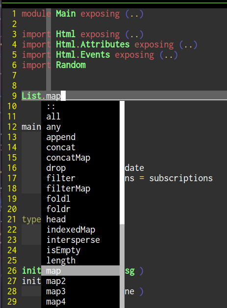

vimrc
=====

Storing a vimrc starter. It has been patched together from various sources, including some code from the .vimrc file in [Haskell Vim Now](https://github.com/begriffs/haskell-vim-now). See the `license` directory for a diff.

Lots of experimentation.

The `master` branch is the main one. Desktop is now `old-master`. The `laptop` branch shouldn't be used. The `old-laptop` branch is what was archived on Dec 21, 2015 before a rewrite from scratch.

## Neovim

This works with Neovim. Create a file called `~/.config/nvim/init.vim` and put this inside it to use the regular `.vimrc` in neovim:

    set runtimepath^=~/.vim runtimepath+=~/.vim/after
    let &packpath = &runtimepath
    source ~/.vimrc

## Installation

This is my personal .vimrc file that is a work in progress. It is intended for personal use only. These are notes to myself on how to install it.

Install Haskell Vim Now. Replace the `~/.vimrc` file with the one from this repo. Run `:PlugClean` and then `PlugInstall` to remove/install the plugins.
